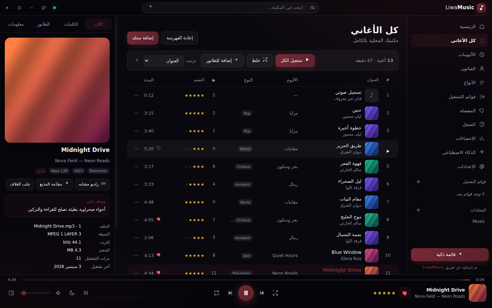
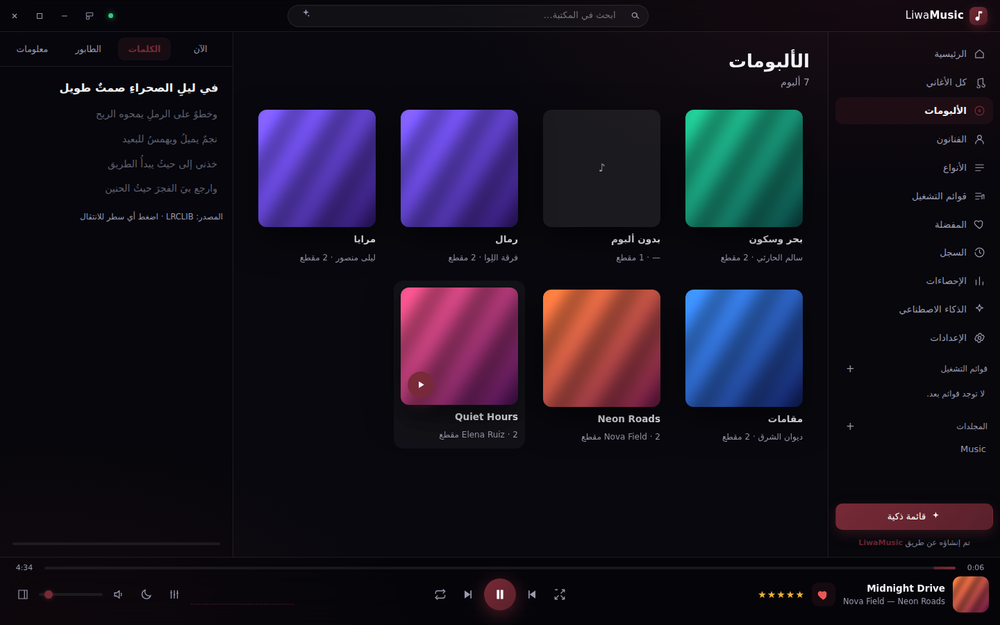
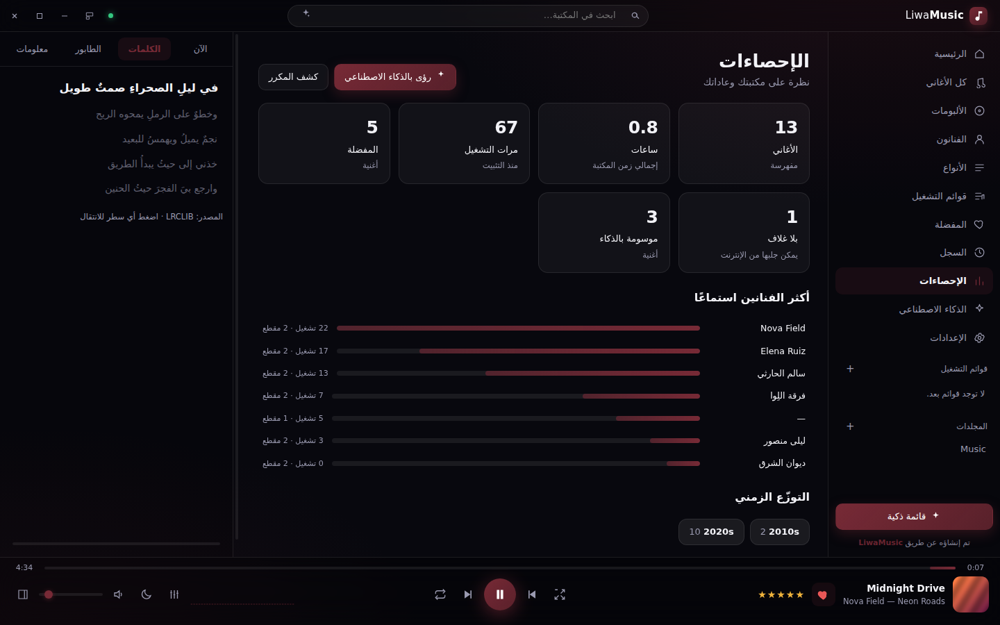

# LiwaMusic — مشغل وفهرس موسيقى ذكي لويندوز

<div align="center"><strong>تم إنشاؤه عن طريق LiwaMusic</strong></div>

<p align="center"></p>

تطبيق **سطح مكتب لويندوز** ترفع فيه مجلد أغانيك فيفهرسها ويشغّلها بمشغّل
حديث التصميم. يعمل محليًا بالكامل، ويستخدم **الإنترنت** لإثراء المكتبة
(أغلفة، كلمات متزامنة، بيانات الألبومات). وفيه ميزات **ذكاء اصطناعي**
اختيارية عبر Claude — **مغلقة افتراضيًا** لأنها وحدها تحتاج مفتاح API مدفوعًا.

---

## ⬇️ التحميل

[](https://github.com/almarar88/mbzuh/releases/tag/music-v1.0.0)

**[⬇ تحميل LiwaMusic لويندوز (64-بت)](https://github.com/almarar88/mbzuh/releases/download/music-v1.0.0/LiwaMusic-Setup-1.0.0.exe)**

بعد التنزيل: شغّل `LiwaMusic-Setup-1.0.0.exe` واتبع خطوات التثبيت (يُثبَّت
للمستخدم الحالي بلا صلاحيات مدير)، ثم افتح **LiwaMusic** من قائمة ابدأ أو من
أيقونة سطح المكتب.

> ويندوز قد يُظهر تنبيه SmartScreen لأن الملف غير موقّع رقميًا:
> «مزيد من المعلومات» ← «تشغيل على أي حال».

### نشر أول إصدار (مرة واحدة)

الرابط أعلاه يعطي **404** حتى يُنشر أول إصدار، لأن بناء ملف `.exe` يحتاج جهاز
ويندوز — وسير العمل الجاهز يفعل ذلك تلقائيًا. اختر إحدى الطريقتين:

**(أ) من سطر الأوامر — الأسرع:**

```bash
git fetch origin
git tag music-v1.0.0 origin/claude/ai-music-player-app-8rg5ty
git push origin music-v1.0.0
```

**(ب) من واجهة GitHub:** ادمج الفرع في `main`، ثم **Actions** ←
«بناء LiwaMusic لويندوز» ← **Run workflow**.

في الحالتين يبني GitHub المثبّت على ويندوز وينشره تحت الوسم `music-v1.0.0`
خلال دقائق، فيعمل رابط التحميل أعلاه مباشرة. الإصدارات التالية: كرّر الخطوة
بوسم جديد (`music-v1.1.0`) بعد رفع رقم الإصدار في `package.json`.

> المستودع يضم مشروعين، لذا الرابط مربوط بوسم LiwaMusic تحديدًا لا بـ
> «آخر إصدار» في المستودع.

## 🚀 البدء في 30 ثانية

1. افتح التطبيق واضغط **إضافة مجلد أغاني** — أو اسحب المجلد وأفلته داخل النافذة.
2. تبدأ الفهرسة فورًا مع شريط تقدّم: قراءة الوسوم واستخراج الأغلفة.
3. اضغط أي أغنية مرتين لتشغيلها. البقية اختيارية ومتاحة متى شئت.

---

## 📸 لقطات

| الرئيسية (مظهر داكن + تلوين مستخرج من الغلاف) | كل الأغاني |
|---|---|
|  |  |

| الكلمات المتزامنة | الإحصاءات |
|---|---|
|  |  |

<p align="center"><br/><sub>المظهر الفاتح — قوائم التشغيل</sub></p>

---

## ✨ المميزات (أكثر من 40)

### الفهرسة والمكتبة
1. **رفع مجلدات متعددة** عبر نافذة الاختيار أو السحب والإفلات داخل التطبيق.
2. **مسح متكرر** لكل المجلدات الفرعية مع تجاهل المخفية وغير الصوتية.
3. **17 صيغة مدعومة**: MP3، FLAC، M4A/AAC، WAV، OGG، OPUS، AIFF، WMA، APE، WavPack…
4. **قراءة الوسوم الكاملة**: العنوان، الفنان، فنان الألبوم، الألبوم، النوع، السنة، رقم المقطع والقرص، معدل البت، التردد، القنوات، الترميز، وهل التسجيل بلا فقد.
5. **استخراج الأغلفة المضمّنة** وحفظها في كاش مشترك لكل ألبوم (لا تكرار).
6. **مسح تزايدي ذكي**: يتخطى الملفات غير المتغيّرة (بحسب الحجم ووقت التعديل)، ويلتقط الجديد ويحذف المفقود.
7. **مراقبة المجلدات** تلقائيًا: أي أغنية جديدة تُضاف على القرص تدخل الفهرس بلا تدخّل.
8. **كشف الأغاني المكررة** (نفس العنوان والفنان والمدة) مع عرض المسارات.
9. **تصدير/استيراد المكتبة** كاملة (الفهرس + التقييمات + القوائم) بملف JSON واحد.
10. **تحرير البيانات محليًا** داخل التطبيق دون المساس بملفاتك الأصلية إطلاقًا.

### التشغيل والصوت
11. **محرّك Web Audio كامل** بسلسلة معالجة احترافية بدل مشغّل بسيط.
12. **طابور تشغيل** قابل لإعادة الترتيب بالسحب، مع «تشغيل التالي» وإزالة وتفريغ.
13. **خلط وتكرار** (إيقاف / تكرار الكل / تكرار الأغنية).
14. **تلاشٍ متقاطع** بين الأغاني حتى 12 ثانية (ديكان صوتيان مستقلان).
15. **تحميل مسبق للأغنية التالية** لانتقال شبه متواصل بلا صمت.
16. **معادل صوتي بعشرة نطاقات** (32Hz–16kHz) مع **11 قالبًا** جاهزًا: مسطّح، بوب، روك، جاز، كلاسيكي، تعزيز الجهير، تعزيز الحدّة، الصوت البشري، إلكتروني، شرقي، وضع ليلي.
17. **تضخيم مسبق (Preamp)** من ‎-12‎ إلى ‎+12‎ ديسيبل.
18. **تطبيع الصوت** لتقليل فروق الجهارة بين الأغاني (ضاغط ديناميكي).
19. **سرعة تشغيل** من 0.5× إلى 2× مع **الحفاظ على طبقة الصوت**.
20. **مؤثر بصري حي** (أعمدة طيفية أو موجة) بلون الواجهة.
21. **مؤقت النوم** مع تلاشٍ تدريجي قبل التوقف.
22. **استئناف آخر جلسة**: يفتح على آخر أغنية وموضعها بالضبط.
23. **مفاتيح الوسائط في لوحة المفاتيح** تعمل حتى والتطبيق في الخلفية.
24. **تكامل مع نظام ويندوز** عبر Media Session (اسم الأغنية والغلاف في لوحة الوسائط) و**شريط تقدّم على أيقونة شريط المهام**.

### الإنترنت
25. **جلب الأغلفة الناقصة** من iTunes بدقة 600×600 وتطبيقها على كل الألبوم.
26. **كلمات الأغاني المتزامنة** من LRCLIB مع تمييز السطر الحالي، تمرير تلقائي، والنقر على أي سطر للانتقال إليه.
27. **إثراء البيانات من MusicBrainz** (السنة، النوع، الوسوم) مع إمكانية تطبيقها بضغطة.
28. **نبذة عن الفنان** من ويكيبيديا (عربي ثم إنجليزي).
29. **مؤشر حالة الاتصال** — كل شيء يعمل بلا إنترنت، والميزات الشبكية إضافة لا شرط.

### الذكاء الاصطناعي — **مغلق افتراضيًا** (اختياري، بمفتاحك)

> هذا القسم كله **مطفأ عند أول تشغيل**: لا تظهر صفحته ولا أزراره في الواجهة،
> ولا يُرسل أي طلب ولا يُحسب عليك أي مبلغ. لتفعيله لاحقًا:
> **الإعدادات ← الميزات الذكية ← تفعيل**، ثم أدخل مفتاح Anthropic API.
> بقية التطبيق — الفهرسة والتشغيل والأغلفة والكلمات — يعمل كاملًا ومجانًا.
30. **تصنيف ذكي** لكل أغنية: المزاج، مستوى الطاقة، الأنواع، وكلمات مفتاحية.
31. **قائمة تشغيل من وصف بلغتك**: «قائمة هادئة للمذاكرة الليلية» — ويختار من مكتبتك فقط بلا اختراع أغانٍ.
32. **بحث دلالي** يفهم القصد لا الكلمات الحرفية.
33. **راديو مشابه**: يبني قائمة تشبه أي أغنية في الأجواء والطاقة مع تنويع الفنانين.
34. **مقدّمات مذيع** متدفقة كلمة بكلمة بين الأغاني.
35. **تقرير رؤى** عن ذوقك، الأنواع الغالبة، والفجوات في مكتبتك.
36. **مفتاح API مشفّر** عبر `safeStorage` من ويندوز، ولا يغادر جهازك ولا تصل إليه الواجهة.

### الواجهة والتجربة
37. **إحدى عشرة صفحة** (عشر عند إغلاق الميزات الذكية): الرئيسية، كل الأغاني، الألبومات، الفنانون، الأنواع، قوائم التشغيل، المفضلة، السجل، الإحصاءات، الذكاء الاصطناعي، والإعدادات.
38. **قائمة افتراضية (Virtual list)** ترسم الصفوف المرئية فقط — عشرات الآلاف من الأغاني بسلاسة.
39. **بحث فوري واعٍ بالعربية**: يوحّد الهمزات والألف والتاء المربوطة ويتجاهل التشكيل.
40. **مفضلة وتقييم بالنجوم** وعدّاد تشغيل وآخر استماع وسجل كامل.
41. **قوائم تشغيل** كاملة مع **استيراد وتصدير M3U8**.
42. **مظهر داكن/فاتح**، ستة ألوان أساسية، و**تلوين ديناميكي مستخرج من غلاف الأغنية الحالية**.
43. **عربي/إنجليزي** مع تبديل الاتجاه RTL/LTR فوريًا.
44. **مشغّل مصغّر** يبقى فوق النوافذ، **اختصارات لوحة مفاتيح كاملة**، وقوائم سياق بالزر الأيمن على كل عنصر.

---

## ⌨️ الاختصارات

| المفتاح | الوظيفة | المفتاح | الوظيفة |
|---|---|---|---|
| مسافة | تشغيل/إيقاف | `S` | الخلط |
| `Ctrl + →` | التالي | `R` | التكرار |
| `Ctrl + ←` | السابق | `M` | كتم الصوت |
| `→` / `←` | ‎±5‎ ثوانٍ | `F` | مفضلة |
| `↑` / `↓` | الصوت | `E` | المعادل |
| `Ctrl + F` | البحث | `L` | الكلمات |
| `Ctrl + M` | المشغّل المصغّر | `Q` | الطابور |
| `1`…`5` | التقييم بالنجوم | | |

---

## 🔐 الخصوصية

- لا يوجد خادم لـ LiwaMusic ولا حساب ولا تتبّع. كل البيانات في مجلد بيانات
  التطبيق على جهازك.
- طلبات الإنترنت تذهب **مباشرة** من جهازك إلى: iTunes (الأغلفة)، LRCLIB
  (الكلمات)، MusicBrainz (البيانات)، ويكيبيديا (نبذة الفنان)، وAnthropic
  (الذكاء الاصطناعي — **مغلق افتراضيًا**، فلا طلب ولا تكلفة ما لم تفعّله بنفسك).
  ويمكن إطفاء كل واحدة منها من الإعدادات.
- الذكاء الاصطناعي يرسل **بيانات وصفية فقط** (عنوان/فنان/ألبوم/نوع/سنة) — لا
  يُرفع أي ملف صوتي أبدًا.
- الواجهة معزولة (`contextIsolation`) بلا وصول إلى Node، والملفات تُقدَّم عبر
  بروتوكول `liwa://` مقصور على الملفات المفهرسة فعلًا.

## 🛠️ التطوير والبناء

```bash
cd liwamusic
npm install
npm start        # تشغيل التطبيق
npm test         # اختبار ذاتي (65 فحصًا) للفهرسة والتخزين والبروتوكول و M3U
npm run dist:win # بناء مثبّت ويندوز (يحتاج ويندوز أو GitHub Actions)
```

البناء الآلي عبر GitHub Actions: ادفع وسمًا يبدأ بـ `music-v` أو شغّل
سير العمل **«بناء LiwaMusic لويندوز»** يدويًا.

### البنية

```
liwamusic/
├── electron/
│   ├── main.js              العملية الرئيسية: النافذة، IPC، بروتوكول liwa://
│   ├── preload.js           جسر آمن معزول للواجهة
│   └── lib/
│       ├── scanner.js       الفهرسة وقراءة الوسوم واستخراج الأغلفة
│       ├── store.js         تخزين JSON بكتابة مؤجّلة وآمنة
│       ├── online.js        iTunes / LRCLIB / MusicBrainz / ويكيبيديا
│       ├── ai.js            تكامل Claude (مفتاح المستخدم، مشفّر)
│       ├── playlists.js     القوائم و M3U8
│       └── filestream.js    خدمة الملفات مع دعم Range للتنقّل
└── renderer/
    ├── index.html · css/app.css
    └── js/  util · i18n · player (محرّك Web Audio) · views · panels · app
```

---

<div align="center">تم إنشاؤه عن طريق <strong>LiwaMusic</strong></div>
