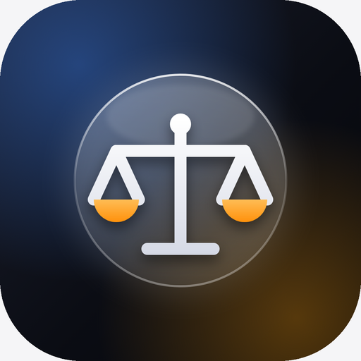
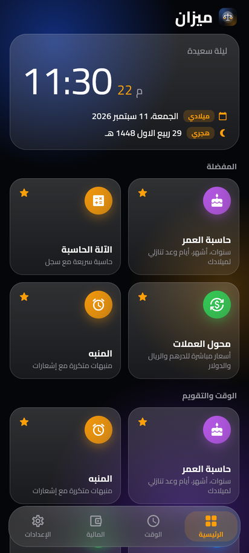
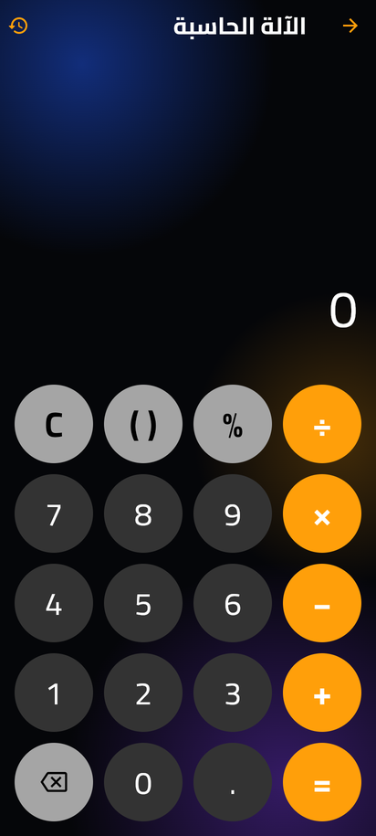
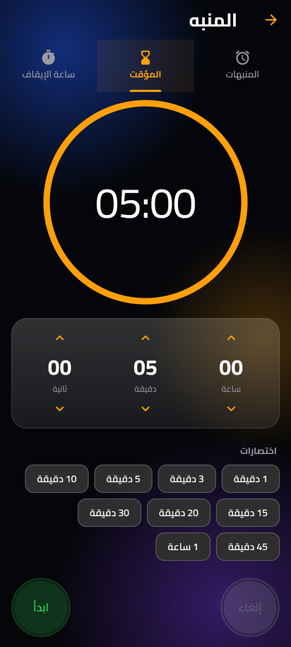
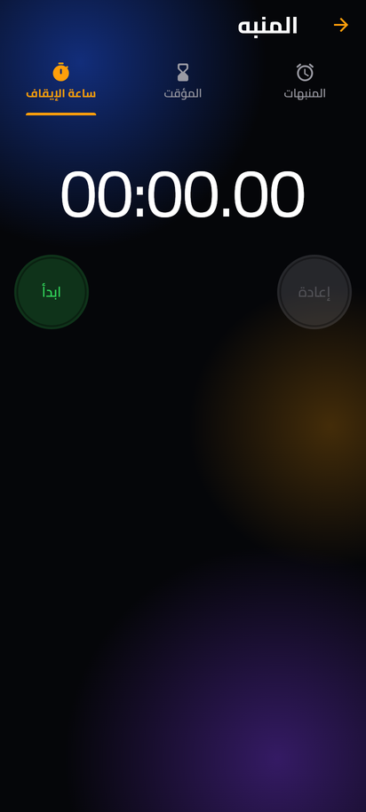
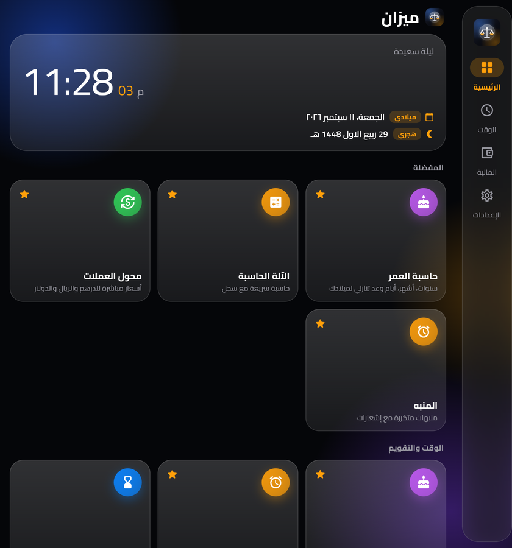

# Mizan · ميزان — أدواتك اليومية

<div align="center"><strong>تطوير Alcode</strong></div>

تطبيق أندرويد (Flutter) يجمع الأدوات التي تحتاجها كل يوم في واجهة عربية أنيقة
بأسلوب تطبيق الساعة في iOS: خلفية داكنة بتوهجات لونية، بطاقات زجاجية شفافة،
شريط تنقل عائم مضبب، أزرار دائرية، ولون برتقالي واحد كلون رئيسي. الاسم
الإنجليزي **Mizan** (يظهر على الجهاز حسب لغة النظام: Mizan / ميزان).

## لقطات

<p align="center">
  
</p>
<p align="center">
  
  
  
  
</p>
<p align="center">
  
</p>

## التصميم

- **زجاج معتم (Frosted glass):** كل الأسطح شبه شفافة بحدود رفيعة ولمعة علوية،
  فتظهر توهجات الخلفية من خلفها. شريط التنقل السفلي يستخدم ضبابية حقيقية
  (`BackdropFilter`) فوق المحتوى المتحرك تحته.
- **الوضع الداكن افتراضي** (مثل تطبيق الساعة)، مع وضع فاتح زجاجي اختياري.
- **الأرقام الكبيرة بوزن خفيف** في الساعة والمنبهات والمؤقت وساعة الإيقاف.
- **الأزرار الدائرية** لبدء/إيقاف المؤقت وساعة الإيقاف (أخضر/أحمر/رمادي)، والحاسبة
  بمفاتيح دائرية وعمليات برتقالية كما في iOS.
- **الأيقونة:** قرص زجاجي بميزان أبيض وكفتين برتقاليتين على خلفية داكنة متوهجة،
  بصيغة Adaptive Icon (خلفية + واجهة + أحادية اللون لثيمات Android 13+).

## الأدوات

| الأداة | ماذا تفعل |
|---|---|
| **الرئيسية** | ساعة حيّة، التاريخ الميلادي والهجري، شبكة أدوات مفضلة (اضغط مطولاً لإضافة/إزالة أداة). |
| **حاسبة العمر** | سنوات/أشهر/أيام بدقة تقويمية، العد التنازلي لعيد الميلاد، يوم الولادة، الميلاد والعمر بالهجري، إجمالي الأيام/الأسابيع/الساعات. |
| **الآلة الحاسبة** | تعبيرات كاملة (أقواس، نسبة مئوية) مع معاينة حيّة للنتيجة وسجل محفوظ. |
| **محول العملات** | 16 عملة (الخليج، الدولار، اليورو…) بأسعار مباشرة من الإنترنت تُخزّن محلياً وتعمل دون اتصال. |
| **المنبه** | منبهات متكررة (يومي/أيام العمل/مخصص) تعمل والتطبيق مغلق عبر إشعارات دقيقة تظهر على شاشة القفل. |
| **المؤقت وساعة الإيقاف** | عد تنازلي مع إشعار عند الانتهاء، وساعة إيقاف بلفّات. |
| **التقويم الهجري** | تحويل هجري ⇄ ميلادي (أم القرى)، المناسبات القادمة، وتصحيح يدوي ±يومين. |
| **الضريبة والخصم** | إضافة/استخراج ضريبة القيمة المضافة (5% افتراضياً) وحساب الخصومات. |
| **محول الوحدات** | طول، وزن، حرارة، مساحة، حجم، سرعة، بيانات. |
| **الإعدادات** | المظهر، اللغة (عربي/إنجليزي)، نمط الأرقام (٠١٢٣ / 0123)، العملة والضريبة الافتراضية، صلاحيات الإشعارات. |

## دعم الأجهزة القابلة للطي

- **مطوي (شاشة الغطاء):** شريط تنقل سفلي وشبكة بعمودين.
- **مفتوح:** شريط جانبي (Navigation Rail) وعرض بلوحتين: قائمة الأدوات على جهة والأداة نفسها على الجهة الأخرى.
- **وضع الكتاب:** يُقرأ موضع المفصلة من `MediaQuery.displayFeatures` ويُقسَّم المحتوى عليها بحيث لا يظهر شيء تحت الطيّة.
- النشاط قابل لتغيير الحجم (`resizeableActivity`) ويعمل في تقسيم الشاشة، ويعيد تخطيطه فوراً عند الطي/الفتح دون فقدان الحالة.

## التحميل

من [صفحة الإصدارات](https://github.com/almarar88/mbzuh/releases) نزّل:

- `Mizan-arm64-v8a.apk` — لمعظم الهواتف الحديثة والقابلة للطي (موصى به).
- `Mizan-universal.apk` — يعمل على أي معالج.

## البناء محلياً

```bash
cd mizan_tools
flutter pub get
flutter test
flutter build apk --release            # build/app/outputs/flutter-apk/app-release.apk
flutter build apk --release --split-per-abi
```

المتطلبات: Flutter 3.47+ و JDK 17+ و Android SDK 36. الحد الأدنى للنظام Android 7.0 (API 24).

## هيكل المشروع

```
lib/
├── main.dart                   # التهيئة والمزوّدون (Provider)
├── app.dart                    # MaterialApp، الثيمات، التوطين، معالجة نقر الإشعار
├── core/
│   ├── constants/colors.dart   # لوحة الألوان
│   ├── theme/app_theme.dart    # Material 3 فاتح/داكن بخط Cairo
│   ├── l10n/strings.dart       # النصوص عربي/إنجليزي
│   ├── utils/responsive.dart   # فئات حجم النافذة + TwoPaneLayout (المفصلة)
│   ├── utils/formatters.dart   # الأرقام، التواريخ، الهجري
│   └── tools_registry.dart     # سجل الأدوات (المصدر الوحيد للشبكة والمفضلة)
├── services/
│   ├── settings_service.dart   # التفضيلات (shared_preferences)
│   ├── notification_service.dart # flutter_local_notifications + timezone
│   ├── alarm_store.dart        # تخزين المنبهات ومزامنتها مع النظام
│   └── currency_service.dart   # أسعار الصرف (open.er-api.com) مع تخزين
├── features/<tool>/presentation/*.dart
└── shared/widgets/             # بطاقات، شبكة الأدوات، الهيكل بلوحتين
```

## ملاحظات

- أسعار العملات من `open.er-api.com` (مجاني، بلا مفتاح). عند غياب الاتصال تُستخدم آخر نسخة محفوظة، وإن لم توجد تُعرض أسعار مرجعية تقريبية مع تنبيه.
- التواريخ الهجرية بحساب أم القرى وقد تختلف يوماً عن الرؤية؛ يمكن تصحيحها من الإعدادات.
- الـAPK موقّع بمفتاح تطوير لسهولة التثبيت المباشر؛ للنشر على المتجر أضف `signingConfig` خاصاً في `android/app/build.gradle.kts`.
